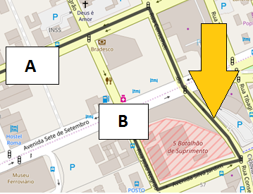

# Capítulo 2

**OpenStreetMap**

_Alex Sandro Custodio Hinckel (Infra Estrutura)_

_Fabio Leandro Lapuinka  (Desenvolvimento)_

## Definição

"OpenStreetMap é um projeto de mapeamento colaborativo para criar um mapa livre e editável do mundo, inspirado por sites como a Wikipédia. 
Traduzindo para português o nome significa Mapa Aberto de Ruas. Os mapas foram desenvolvidos e são mantidos com rigor por sua comunidade  voluntária de mapeadores, que inserem e revisam dados de receptores GPS portatéis, fotografias aéreas, imagens de satélite e outras fontes livres. 
Os mapeadores, com seu conhecimento local, editam os mapas com softwares abertos como o iD ou o JOSM. A comunidade mais ampla, também confere e confirma os dados pela interface do próprio site Openstreetmap.org. 
Todos os mapas, dados descritivos, e metadados ofertados pelo OSM são dados abertos, disponíveis sob uma licença Open Database License.[2] Além da comunidade que doa as informações postadas, quando faz uso de outras fontes (imagens obtidas por processamento dos dados, tabelas e outros) são compatíveis com a sua licença. Os dados são formalmente operados pela OpenStreetMap Foundation (OSMF) em nome da comunidade de mapeadores." 

Fonte: https://pt.wikipedia.org/wiki/OpenStreetMap

Foque nos conjunto de dados geoespaciais, este é o coração do projeto, todos os aplicativos e bibliotecas que vou mostrar, são implementações de aplicações que usam estes dados.

Aqui você pode baixar a base de dados de Mapa do mundo inteiro: http://download.geofabrik.de/

## Uso simples

Como  desenvolvedor você pode extrair as informações do OpenStreetMaps e utilizar para o seu projeto. Por exemplo, você responder as seguintes perguntas:

**Quais são os hospitais mais próximos da minha casa num raio de 5km?**

**O ponto atual que me encontro, está fora da área permitida?**

**Me informe a rota do ponto A ao ponto B, utilizando uma estratégia a pé.**

**Quais são meus clientes que estão mais próximos do vendedor X?**

Visualização de elementos de um mapa

a) Mapa (arquivos PNG(TILES) criados a partir do download de http://download.geofabrik.de/)

 
b) Veja o caminho do ponto A ao ponto B, eles desenho é uma rota feita em tempo de execução com outra ferramenta agregada o OSRM

## Referências

Aqui temos um passo a passo de como utilizar a ferramenta OSM.

_Wiki especializada  no OpenStreetMaps:_

https://wiki.openstreetmap.org/wiki/Main_Page

_Tradução:_

https://translate.mapsmarker.com/projects/lmm

_Docker_

https://hub.docker.com/r/homme/openstreetmap-tiles-docker/ 

## Conclusão

Invista neste projeto, ele é um diferencial tecnológico e faz parte da infra estrutura básica de programas georeferenciados. 
Começe simples, logo logo você vai também se apaixonar pelo projeto.

http://leafletjs.com/

http://www.liedman.net/leaflet-routing-machine/
 
