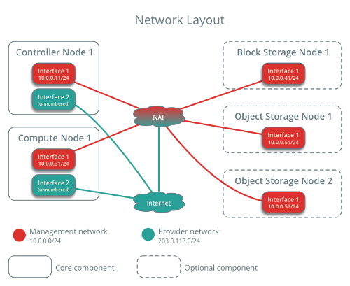

# Capítulo 3

## OpenStack: Implantação e uso

### Requisitos de hardware e software

O OpenStack é composto por uma estrutura modular. Embora seja possível realizar uma instalação mínima em uma única máquina (física ou virtual) para fins didáticos, uma instalação de produção requer várias máquinas físicas para distribuir adequadamente os diversos serviços.

A figura abaixo ilustra uma possível arquitetura de hardware: 

A figura abaixo ilustra uma possível arquitetura de software: 

**Nó de controle**: Executa os serviços de identidade, imagem, gerenciamento do serviço de computação, gerenciamento do serviço de rede, vários agentes de rede e o console. Além disso este nó abriga serviços de suporte tais como o banco de dados SQL, fila de mensagens e NTP. Necessita de pelo menos duas interfaces de rede.

**Nó de computação**: Executa a parte do hipervisor que opera instâncias. Por padrão, o nó de computação usa o hipervisor KVM. O nó de computação também executa um serviço de rede que conecta instâncias às redes virtuais e provê serviços de firewall para as instâncias através de grupos de segurança.

**Nó de armazenamento de blocos**: Contém os discos que o serviço de armazenamento provisiona para as instâncias.

### Rede física

Uma vez instalado o sistema operacional desejado em cada um dos nós, é necessário configurar as interfaces de rede. Todos os nós requerem acesso à internet para fins administrativos tais como instalação de pacotes, atualizações, DNS e NTP.

A figura abaixo exemplifica uma hipotética configuração de rede física: 

Instâncias podem ser conectadas diretamente à rede de gerenciamento (pública) ou à rede virtual (privada).

### Serviços do Openstack

Alguns serviços essenciais para operação do Openstack são:

* **Gerenciamento de redes virtuais (neutron)**: Suporte à criação de redes virtuais.

* **Provisionamento de recursos de computação (nova)**: Suporte ao provisionamento de máquinas virtuais e recursos associados.

* **Gerenciamento de imagens (glance)**: Suporte à criação de imagens de sistemas operacionais para criação de máquinas virtuais.

* **Armazenamento em blocos (cinder)**: Alocação de volumes de dados alocados às máquinas virtuais.

* **Console de gerenciamento Web (horizon)**: Interface Web criação de máquinas virtuais, volumes, redes além de outros serviços opcionais.

Outros serviços podem ser disponibilizados, por exemplo:

* **Máquina física (ironic)**: Suporte ao gerenciamento e provisionamento de máquinas físicas.
            
* **Orquestração de contêineres (magnum)**: Suporte a motores de orquestração de contêineres tais como Docker Swarm, Kubernetes e Mesos.

* **Banco de dados (trove)**: Suporte a provisionamento de bancos de dados.

* **Gerenciamento de credenciais (barbican)**: Suporte ao armazenamento de dados secretos tais como senhas, chaves criptográficas e certificados digitais.

* **Mensagens (zaqar)**: Suporte ao compartilhamento de informações entre componentes e aplicações distribuídas.
            
* **Armazenamento de objetos (swift)**: Suporte ao armazenamento e recuperação de objetos.

* **Orquestração (heat)**: Suporte à orquestração de recursos na nuvem.

* **Sistemas de arquivos compartilhados (manila)**: Acesso coordenado a sistemas de arquivos distribuídos.

* **Telemetria e alarmes (aodh)**: Dispara alarmes quando medidas ou eventos coletados excedem regras definidas.

* **Coleta de dados de telemetria (ceilometer)**: Eficientemente monitora dados relacionados aos serviços do OpenStack, coleta eventos e dados de monitoramento enviados por serviços, publica dados coletados em diversos meios.

