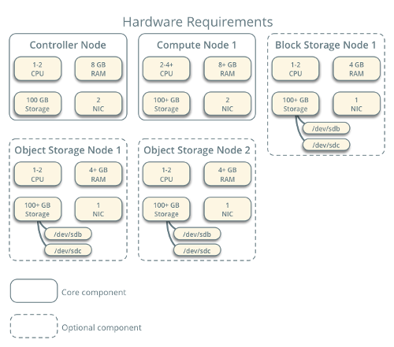
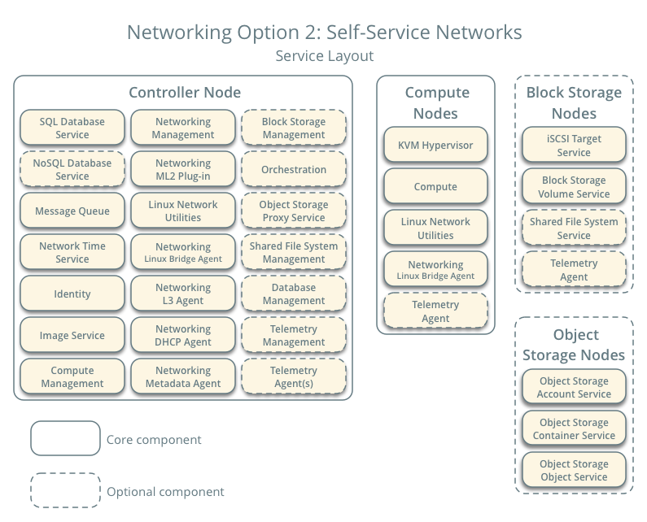

# Capítulo 3

## OpenStack: Implantação e uso

### Requisitos de hardware e software

O OpenStack é composto por uma estrutura modular. Embora seja possível realizar uma instalação mínima em uma única máquina (física ou virtual) para fins didáticos, uma instalação de produção requer várias máquinas físicas para distribuir adequadamente os diversos serviços.

A figura abaixo ilustra uma possível arquitetura de hardware: 

A figura abaixo ilustra uma possível arquitetura de software: 

**Nó de controle**: Executa os serviços de identidade, imagem, gerenciamento do serviço de computação, gerenciamento do serviço de rede, vários agentes de rede e o console. Além disso este nó abriga serviços de suporte tais como o banco de dados SQL, fila de mensagens e NTP. Necessita de pelo menos duas interfaces de rede.

**Nó de computação**: Executa a parte do hipervisor que opera instâncias. Por padrão, o nó de computação usa o hipervisor KVM. O nó de computação também executa um serviço de rede que conecta instâncias às redes virtuais e provê serviços de firewall para as instâncias através de grupos de segurança.

**Nó de armazenamento de blocos**: Contém os discos que o serviço de armazenamento provisiona para as instâncias.

