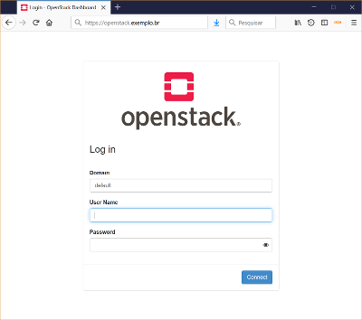
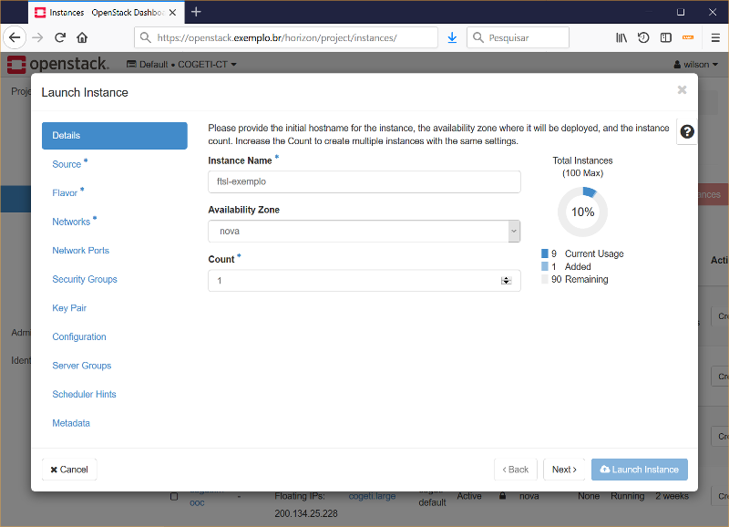

# Capítulo 3

## OpenStack: Implantação e uso
*Wilson Horstmeyer Bogado*

### Apresentação

O [Openstack](http://openstack.org) é um software modular que permite implantar uma infraestrutura de nuvem pública ou privada.

### Requisitos de hardware e software

O OpenStack é composto por uma estrutura modular. Embora seja possível realizar uma instalação mínima em uma única máquina (física ou virtual) para fins didáticos, uma instalação de produção requer várias máquinas físicas para distribuir adequadamente os diversos serviços.

A figura abaixo ilustra uma possível arquitetura de hardware: 

A figura abaixo ilustra uma possível arquitetura de software: 

**Nó de controle**: Executa os serviços de identidade, imagem, gerenciamento do serviço de computação, gerenciamento do serviço de rede, vários agentes de rede e o console. Além disso este nó abriga serviços de suporte tais como o banco de dados SQL, fila de mensagens e NTP. Necessita de pelo menos duas interfaces de rede.

**Nó de computação**: Executa a parte do hipervisor que opera instâncias. Por padrão, o nó de computação usa o hipervisor KVM. O nó de computação também executa um serviço de rede que conecta instâncias às redes virtuais e provê serviços de firewall para as instâncias através de grupos de segurança.

**Nó de armazenamento de blocos**: Contém os discos que o serviço de armazenamento provisiona para as instâncias.

### Rede física

Uma vez instalado o sistema operacional desejado em cada um dos nós, é necessário configurar as interfaces de rede. Todos os nós requerem acesso à internet para fins administrativos tais como instalação de pacotes, atualizações, DNS e NTP.

A figura abaixo exemplifica uma hipotética configuração de rede física: 

Instâncias podem ser conectadas diretamente à rede de gerenciamento (pública) ou à rede virtual (privada).

### Serviços do Openstack

Alguns serviços essenciais para operação do Openstack são:

* **Gerenciamento de redes virtuais (neutron)**: Suporte à criação de redes virtuais.

* **Provisionamento de recursos de computação (nova)**: Suporte ao provisionamento de máquinas virtuais e recursos associados.

* **Gerenciamento de imagens (glance)**: Suporte à criação de imagens de sistemas operacionais para criação de máquinas virtuais.

* **Armazenamento em blocos (cinder)**: Alocação de volumes de dados alocados às máquinas virtuais.

* **Console de gerenciamento Web (horizon)**: Interface Web criação de máquinas virtuais, volumes, redes além de outros serviços opcionais.


Outros serviços podem ser disponibilizados, por exemplo:

* **Máquina física (ironic)**: Suporte ao gerenciamento e provisionamento de máquinas físicas.
            
* **Orquestração de contêineres (magnum)**: Suporte a motores de orquestração de contêineres tais como Docker Swarm, Kubernetes e Mesos.

* **Banco de dados (trove)**: Suporte a provisionamento de bancos de dados.

* **Gerenciamento de credenciais (barbican)**: Suporte ao armazenamento de dados secretos tais como senhas, chaves criptográficas e certificados digitais.

* **Mensagens (zaqar)**: Suporte ao compartilhamento de informações entre componentes e aplicações distribuídas.
            
* **Armazenamento de objetos (swift)**: Suporte ao armazenamento e recuperação de objetos.

* **Orquestração (heat)**: Suporte à orquestração de recursos na nuvem.

* **Sistemas de arquivos compartilhados (manila)**: Acesso coordenado a sistemas de arquivos distribuídos.

* **Telemetria e alarmes (aodh)**: Dispara alarmes quando medidas ou eventos coletados excedem regras definidas.

* **Coleta de dados de telemetria (ceilometer)**: Eficientemente monitora dados relacionados aos serviços do OpenStack, coleta eventos e dados de monitoramento enviados por serviços, publica dados coletados em diversos meios.


## Provisionamento

O provisionamento de máquinas virtuais e dos recursos associados pode ser feito através de comandos no terminal do nó de controle. O formato geral dos comandos do Openstack é:

```
openstack <serviço> <operação> <argumentos>
```

Por exemplo, para criar um volume bootável de 20GB baseado na imagem teste, com o nome de volume-teste, poderíamos executar:

```
$ openstack volume create --size 20 --image teste --bootable volume-teste
```

Pode-se obter ajuda sobre qualquer comando, total ou parcial com a opção -h. Por exemplo para obter informações sobre a operação do comando volume create poderíamos executar:

```
$ openstack volume create -h
usage: openstack volume create [-h] [-f {json,shell,table,value,yaml}]
                               [-c COLUMN] [--max-width <integer>]
                               [--fit-width] [--print-empty] [--noindent]
                               [--prefix PREFIX] [--size <size>]
                               [--type <volume-type>]
                               [--image <image> | --snapshot <snapshot> | --source <volume> | --source-replicated <replicated-volume>]
                               [--description <description>] [--user <user>]
                               [--project <project>]
                               [--availability-zone <availability-zone>]
                               [--consistency-group consistency-group>]
                               [--property <key=value>] [--hint <key=value>]
                               [--multi-attach] [--bootable | --non-bootable]
                               [--read-only | --read-write]
                               <name>

Create new volume

positional arguments:
  <name>                Volume name

optional arguments:
  -h, --help            show this help message and exit
  --size <size>         Volume size in GB (Required unless --snapshot or
                        --source or --source-replicated is specified)
  --type <volume-type>  Set the type of volume
  --image <image>       Use <image> as source of volume (name or ID)
  --snapshot <snapshot>
                        Use <snapshot> as source of volume (name or ID)
  --source <volume>     Volume to clone (name or ID)
  --source-replicated <replicated-volume>
                        Replicated volume to clone (name or ID)
  --description <description>
                        Volume description
  --user <user>         Specify an alternate user (name or ID)
  --project <project>   Specify an alternate project (name or ID)
  --availability-zone <availability-zone>
                        Create volume in <availability-zone>
  --consistency-group consistency-group>
                        Consistency group where the new volume belongs to
  --property <key=value>
                        Set a property to this volume (repeat option to set
                        multiple properties)
  --hint <key=value>    Arbitrary scheduler hint key-value pairs to help boot
                        an instance (repeat option to set multiple hints)
  --multi-attach        Allow volume to be attached more than once (default to
                        False)
  --bootable            Mark volume as bootable
  --non-bootable        Mark volume as non-bootable (default)
  --read-only           Set volume to read-only access mode
  --read-write          Set volume to read-write access mode (default)

output formatters:
  output formatter options

  -f {json,shell,table,value,yaml}, --format {json,shell,table,value,yaml}
                        the output format, defaults to table
  -c COLUMN, --column COLUMN
                        specify the column(s) to include, can be repeated

table formatter:
  --max-width <integer>
                        Maximum display width, <1 to disable. You can also use
                        the CLIFF_MAX_TERM_WIDTH environment variable, but the
                        parameter takes precedence.
  --fit-width           Fit the table to the display width. Implied if --max-
                        width greater than 0. Set the environment variable
                        CLIFF_FIT_WIDTH=1 to always enable
  --print-empty         Print empty table if there is no data to show.

json formatter:
  --noindent            whether to disable indenting the JSON

shell formatter:
  a format a UNIX shell can parse (variable="value")

  --prefix PREFIX       add a prefix to all variable names
```

Embora os comandos do Openstack sejam relativamente fáceis, com opções bastante intuitivas, em geral usamos o console Web (horizon) para provisionar recursos.

A figura abaixo mostra a página de login do horizon:



Por exemplo, para criar uma nova instância (máquina virtual) no horizon usamos a opção Project / Compute / Instances:


